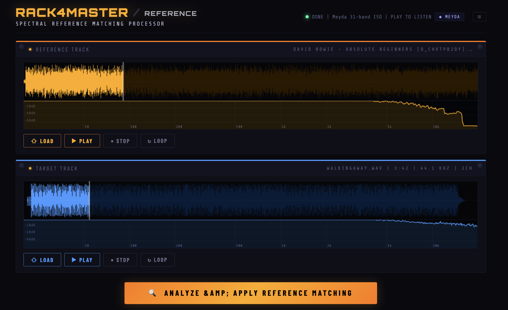
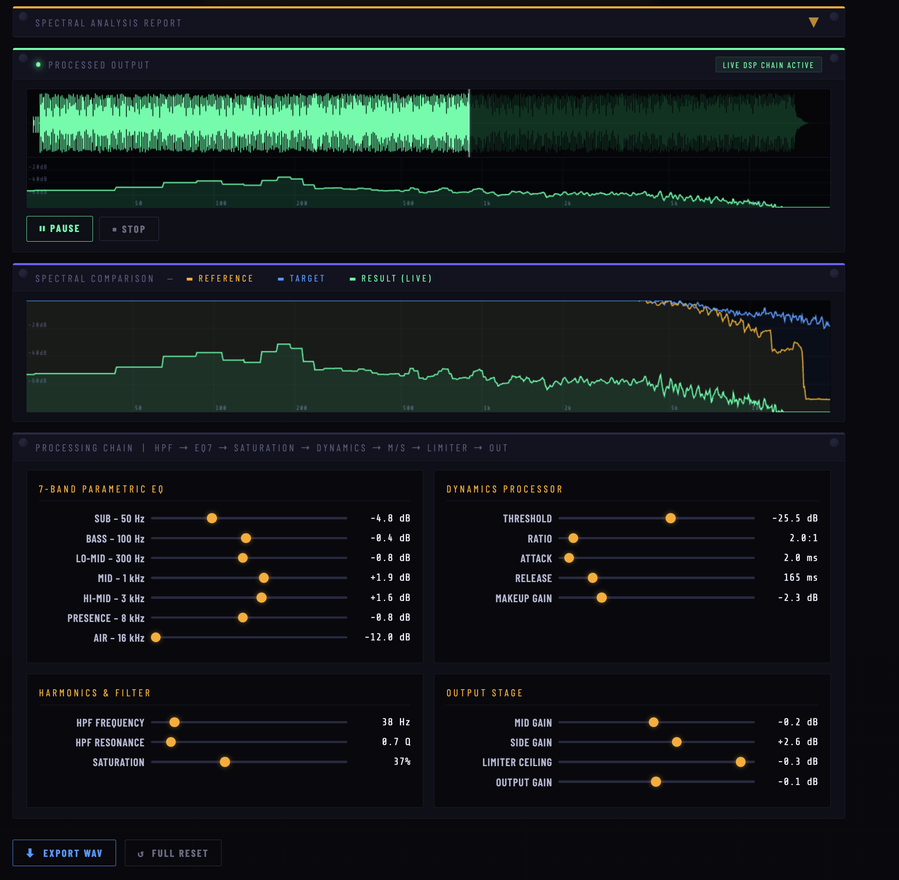
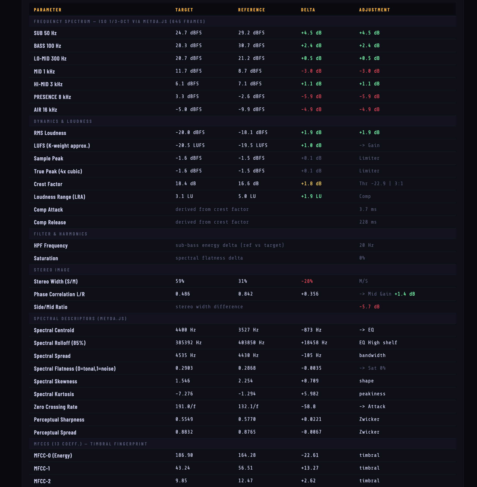

# RACK4MASTER / Auto

> **Spectral Auto Matching Processor
> Intelligent EQ matching and mastering chain that runs entirely in your browser. No uploads, no accounts, no tracking.

---

## ✨ Features

- **Spectral Reference Matching** — load any reference track and auto-match your target's tonal balance using FFT analysis
- **7-Band Parametric EQ** — sub, bass, lo-mid, mid, hi-mid, presence and air bands (±12 dB)
- **Dynamics Processor** — compressor with threshold, ratio, attack, release and makeup gain
- **HPF + Saturation** — high-pass filter with resonance control and harmonic saturation
- **M/S Output Stage** — independent mid/side gain, limiter ceiling and output gain
- **Live DSP Chain** — real-time preview of the processed signal before export
- **Spectral Comparison View** — overlaid reference / target / result spectrum
- **Loop playback with movable handles** — drag loop in/out points directly on the waveform
- **WAV Export** — 16-bit PCM export, processed offline at full quality
- **Internationalisation** — English · Español · Català (always starts in English, no data stored)
- **100% browser** — Web Audio API, zero server-side processing, zero data collection

---

## 📸 Screenshots

  
*Main application window with reference and target tracks loaded.*

  
*Collapsible analysis panel showing per‑band deltas and recommended adjustments.*

  
*Real‑time DSP chain, spectral comparison view and WAV export options.*

---

## 🚀 Getting Started

No build step or install required. Just open `index.html` in a modern browser.
